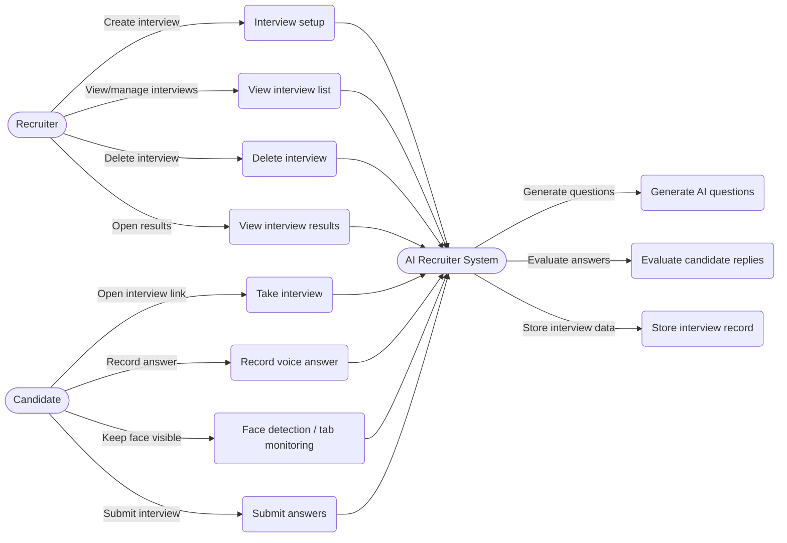
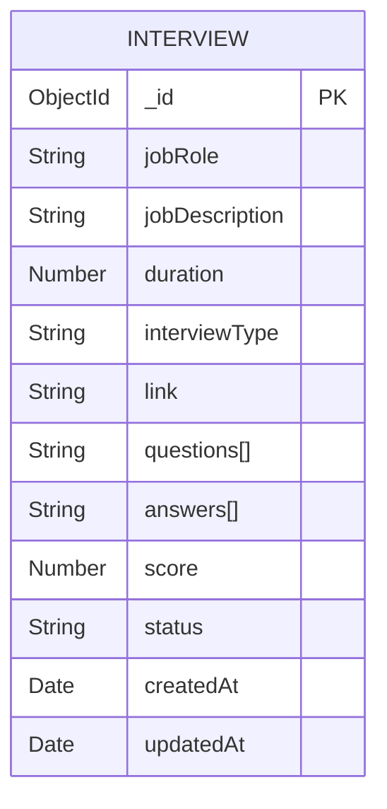
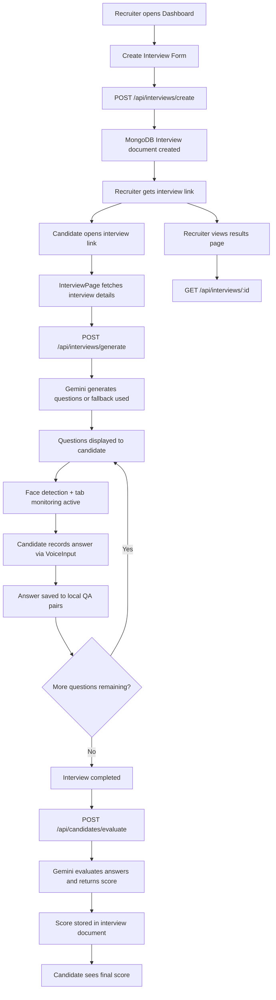

# AI Recruiter - Intelligent Interview Platform

A full-stack AI-powered interview platform that automates the interview process using Google Gemini AI. Recruiters can create interviews, and candidates can take voice-based interviews that are automatically evaluated with face detection and tab monitoring.

## 🚀 Features

### Core Features
- **AI-Powered Question Generation**: Automatically generates interview questions based on job role and description
- **Voice-Based Interviews**: Candidates answer questions using voice input (Web Speech API)
- **Automatic Evaluation**: AI evaluates candidate responses and provides scores
- **Face Detection**: Monitors candidate presence during interviews using face-api.js
- **Tab Monitoring**: Detects when candidates switch tabs and shows warnings
- **Interview Management**: Create, view, and manage multiple interviews
- **Real-time Transcription**: Live transcription of candidate responses
- **Fallback System**: Gracefully handles API quota limits with pre-generated questions

### Technical Highlights
- **Full-Stack Architecture**: React frontend + Node.js/Express backend
- **MongoDB Database**: Persistent storage for interviews and results
- **RESTful API**: Clean API design with proper error handling
- **Responsive Design**: Modern UI with Tailwind CSS
- **Rate Limiting**: Smart handling of API rate limits with automatic retries
- **Browser Security**: Camera and microphone permission handling

## 📋 Prerequisites

- Node.js (v14 or higher)
- MongoDB (local or cloud instance like MongoDB Atlas)
- Google Gemini API Key ([Get one here](https://aistudio.google.com/apikey))
- Modern web browser with camera and microphone support (Chrome, Firefox, Safari, Edge)

## 🛠️ Installation

### Backend Setup

1. Navigate to the backend directory:
```bash
cd backend
```

2. Install dependencies:
```bash
npm install
```

3. Create a `.env` file in the backend directory:
```env
MONGO_URI=your_mongodb_connection_string
GEMINI_API_KEY=your_gemini_api_key
PORT=5000
FRONTEND_URL=http://localhost:3000
```

4. Start the backend server:
```bash
npm start
# or for development with auto-reload:
npm run dev
```

### Frontend Setup

1. Navigate to the frontend directory:
```bash
cd frontend
```

2. Install dependencies:
```bash
npm install
```

3. Start the development server:
```bash
npm start
```

The application will open at `http://localhost:3000`

## 📁 Project Structure

```
AI Recruiter/
├── backend/
│   ├── config/          # Database configuration
│   ├── controllers/     # Request handlers
│   ├── models/          # Mongoose schemas
│   ├── routes/          # API routes
│   ├── utils/           # Utility functions (Gemini AI service)
│   └── server.js        # Express server setup
├── frontend/
│   ├── src/
│   │   ├── components/  # Reusable React components
│   │   │   ├── VoiceInput.js
│   │   │   └── VoiceInputWrapper.js
│   │   ├── pages/       # Page components
│   │   │   ├── Dashboard.js
│   │   │   ├── InterviewPage.js
│   │   │   ├── ResultsPage.js
│   │   │   └── VoiceTestPage.js
│   │   └── App.js       # Main app component
│   └── public/          # Static files
└── README.md
```

## 🎯 Usage

### For Recruiters

1. **Create an Interview**:
   - Fill in job role, description, duration, and interview type
   - Click "Create Interview"
   - Copy the generated interview link

2. **Share the Link**:
   - Send the interview link to candidates
   - Candidates can access the interview directly

3. **View Results**:
   - Check interview status and scores
   - Review candidate responses

### For Candidates

1. **Access Interview**:
   - Click on the interview link provided by the recruiter
   - Wait for questions to be generated
   - Allow camera and microphone permissions when prompted

2. **Answer Questions**:
   - Keep your face visible in the camera preview
   - Click the microphone button to start recording
   - Speak your answer clearly
   - Click stop when finished
   - Avoid switching tabs during recording (warnings will appear)

3. **Face Detection**:
   - The system monitors your presence during answers
   - Keep your face visible to the camera
   - Warnings appear if face is not detected

4. **View Results**:
   - After completing all questions, view your score
   - Results are automatically saved

## 🔧 API Endpoints

### Interviews
- `GET /api/interviews` - Get all interviews
- `GET /api/interviews/:id` - Get interview by ID
- `POST /api/interviews/create` - Create new interview
- `POST /api/interviews/generate` - Generate interview questions (with fallback support)
- `DELETE /api/interviews/:id` - Delete interview by ID

### Evaluation
- `POST /api/candidates/evaluate` - Evaluate interview answers and return score

### Features
- **Fallback Questions**: Automatic fallback to pre-generated questions when Gemini API is unavailable
- **Rate Limiting**: Smart retry logic with exponential backoff for API calls
- **Error Handling**: Comprehensive error handling with user-friendly messages

## 🎨 Technologies Used

### Frontend
- **React 19** - UI library
- **React Router** - Client-side routing
- **Tailwind CSS** - Styling
- **Web Speech API** - Voice recognition
- **face-api.js** - Face detection and landmark recognition
- **react-webcam** - Camera access and video streaming

### Backend
- **Node.js** - Runtime environment
- **Express** - Web framework
- **MongoDB** - Database
- **Mongoose** - ODM for MongoDB
- **Google Gemini AI** - AI question generation and evaluation

## 📊 Features in Detail

### Smart Question Generation
- Generates contextual questions based on job role and description
- Supports Technical and HR interview types
- Handles API rate limits gracefully with fallback questions

### Voice Recognition
- Real-time speech-to-text conversion
- Continuous recording with auto-restart
- Accumulates all spoken words accurately

### Face Detection & Monitoring
- Real-time face detection using face-api.js
- Monitors candidate presence during recording
- Shows warnings when face is not detected
- Prevents cheating by ensuring candidate attention

### Tab Monitoring
- Detects when candidates switch browser tabs
- Shows alert warnings during interviews
- Maintains interview integrity

### AI Evaluation
- Evaluates answers based on relevance and quality
- Provides scores out of 100
- Stores complete Q&A pairs for review

## 🚧 Future Enhancements

- [x] Face detection during interviews
- [x] Tab monitoring and cheating prevention
- [ ] User authentication and authorization
- [ ] Resume/CV upload and parsing
- [ ] Interview analytics dashboard
- [ ] Email notifications
- [ ] PDF export of results
- [ ] Multiple interview rounds
- [ ] Video interview support
- [ ] Candidate profile management
- [ ] Advanced evaluation metrics

## 📈 System Diagrams

### Use Case Diagram


### ER Diagram


### Workflow Diagram


## 📝 License

This project is open source and available under the [MIT License](LICENSE).

## 👨‍💻 Author

Built with ❤️ for modernizing the recruitment process

## 🙏 Acknowledgments

- Google Gemini AI for powerful AI capabilities
- Web Speech API for voice recognition
- MongoDB for reliable data storage

---

**Note**: This project uses the free tier of Google Gemini API which has rate limits (20 requests/day). For production use, consider upgrading to a paid plan.

